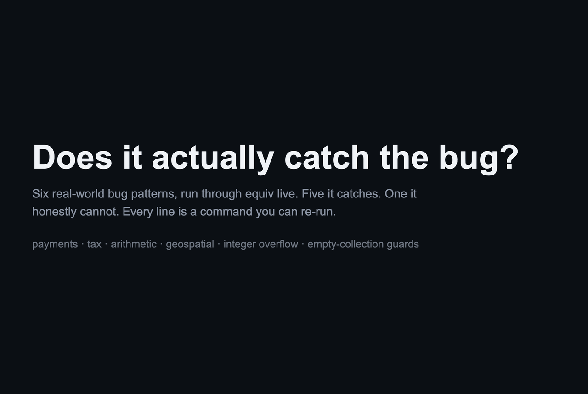

# equiv across real-world bug patterns

Six refactors that looked behaviour-preserving. Each passed review and passed the tests.
Each one is run through `equiv` live. The catches, the honest misses, the warts.
Every result here is reproducible with the files in this folder.



## Scoreboard

| # | Scenario | Domain | equiv verdict | Honest note |
|---|----------|--------|---------------|-------------|
| 1 | Stripe zero-decimal currency (`amount * 100`) | payments | CAUGHT | Exact values. Real: Drupal commerce_stripe #2913605. |
| 2 | Tax personal-allowance floor dropped | tax/payroll | CAUGHT | Phantom negative tax below the allowance. |
| 3 | Gauss sum, negative clamp dropped | arithmetic | CAUGHT | Tests at 1, 5, 10 pass. Only negatives break. |
| 4 | Antimeridian guard added | geospatial | CAUGHT* | Real: chrisveness/geodesy v1.1.2 #44. Display bug below. |
| 5 | Binary-search midpoint overflow | integer overflow | MISSED | Out of scope. Python ints are unbounded. |
| 6 | Average, empty-list guard dropped | edge guard | CAUGHT* | Display bug below. |

## What this shows, honestly

**equiv is value-accurate for integer functions.** Scenarios 1 to 3 are pure integer
arithmetic and comparisons. equiv returns the exact diverging input and the exact old
and new outputs, matching real Python.

**equiv says EQUIVALENT when it genuinely cannot see a bug.** Scenario 5 is the famous
`(low + high) / 2` overflow. That bug exists in C and Java, where ints are fixed-width.
Python ints are unbounded. The two functions really are equivalent in Python. equiv says so. It does not invent a bug that the language cannot have. A real scope limit,
stated plainly.

**Two known warts (both reproducible here):**

1. **No fixed-width overflow.** See scenario 5. If your bug only exists under 32 or 64-bit
   integer wraparound, running the Python form will not surface it.
2. **An exception on one side blanks the other side to `None` in the printout.** In
   scenarios 4 and 6 the candidate raises (a `ValueError` past the antimeridian, a
   `ZeroDivisionError` on the empty list). equiv correctly reports the two functions as
   NOT equivalent. It prints `reference -> None` where the real value is `25` and `0`.
   The verdict is right. The displayed value is not. Trust the verdict on exception cases,
   not the shown value.

This honesty is the point. equiv tells you what it checked and nothing more.

## Reproduce any scenario

Build the CLI once (`cargo build --release -p equiv-cli`), then:

```
equiv review stripe-jpy/candidate.py            stripe-jpy/reference.py            to_minor_units int
equiv review tax-allowance-floor/candidate.py   tax-allowance-floor/reference.py  tax            int
equiv review gauss-clamp/candidate.py           gauss-clamp/reference.py          total          int
equiv review geodesy-antimeridian/candidate.py  geodesy-antimeridian/reference.py normalize_lon  int
equiv review binary-search-overflow/candidate.py binary-search-overflow/reference.py mid          int,int
equiv review empty-collection-guard/candidate.py empty-collection-guard/reference.py average      list[int]
```

Add `--sign` (with `EQUIV_SIGNING_KEY` set) for a signed receipt you can verify with
`equiv verify-receipt`.

## Sources for the real incidents

- Stripe zero-decimal currencies: https://docs.stripe.com/currencies and https://www.drupal.org/project/commerce_stripe/issues/2913605
- geodesy antimeridian: https://github.com/chrisveness/geodesy/issues/44
- binary-search overflow: https://research.google/blog/extra-extra-read-all-about-it-nearly-all-binary-searches-and-mergesorts-are-broken/
